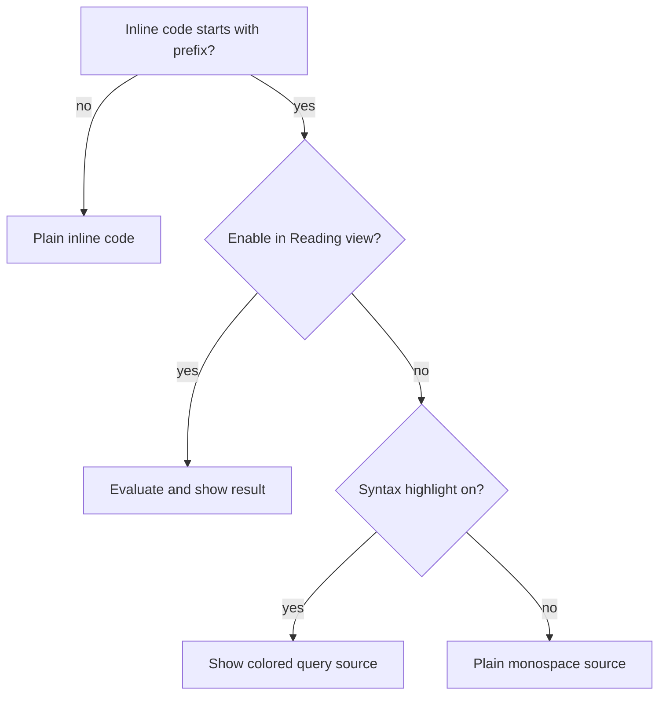

# Grimoire — Language Guide

Complete reference for **Property Query Language (PQL)** as implemented in Grimoire v0.6.0.

Expressions live in inline code with the **`q=`** prefix (configurable under Settings):

```markdown
`q= default(title, "Untitled")`
`q= default(characterStatus, "<font color=\"#595959\">Alive, Dead, Undead.</font>") AS card`
```

Open notes in **Reading view** to see results when **Enable in Reading view** is on. With evaluation off, Reading view shows syntax-colored query source instead.

**Syntax highlighting** (Settings → *Syntax highlight inline queries*, on by default) colorizes `` `q= …` `` in the editor (Source mode and Live Preview) and in Reading view when evaluation is disabled. When Reading view evaluation is on, expressions are replaced by their results — no source highlighting there.

---

## Query syntax

| Part | Rule |
|------|------|
| Prefix | `q=` at the start of inline code (default) |
| Body | Single PQL expression |
| Style | Optional `AS <style>` postfix on any subexpression |
| Scope | Always the **current note** being rendered |
| Whitespace | Ignored outside quoted strings |

---

## Context — where values come from

### Frontmatter properties

Bare names read YAML frontmatter on the current note:

| Syntax | Resolves to |
|--------|-------------|
| `title` | Frontmatter field `title` |
| `pageColour` | Frontmatter field `pageColour` |
| `this.title` | Same as `title` (optional alias) |

Missing fields evaluate to `null`.

### Page metadata (`file.*`)

Reserved namespace for native file metadata (not frontmatter):

| Field | Type | Description |
|-------|------|-------------|
| `file.name` | string | Basename without `.md` |
| `file.path` | string | Vault path |
| `file.folder` | string | Parent folder path |
| `file.ctime` | date | Creation time |
| `file.mtime` | date | Last modification time |
| `file.size` | number | File size in bytes |
| `file.tags` | list | YAML tags merged with inline `#tags` |

`this.file.mtime` works as a deprecated alias for `file.mtime`.

If you have a frontmatter field literally named `file`, use it as a bare identifier (`file` alone). Only `file.<member>` uses the metadata namespace.

---

## Value types

| Type | Literals / sources | Notes |
|------|-------------------|-------|
| **null** | `null`, `None` | Renders empty; falsy for `default` / `choice` / `any` |
| **boolean** | `true`, `false` | |
| **number** | `42`, `3.14` | |
| **string** | `"hello"`, `'text'` | Single or double quotes; `\` escapes the closing quote |
| **date** | `file.mtime`, `date("2024-01-01")`, `date(now)`, `date(today)`, ISO YAML dates | Internal epoch ms; formatted with `dateformat` |
| **duration** | `date - date`, `dur(1, "day")` | Internal ms length; display with `durationformat` |
| **list** | YAML arrays, `file.tags`, `slice(...)` | Coerce to comma-separated text in output |

---

## Operators

### Arithmetic

| Op | Meaning | Notes |
|----|---------|-------|
| `+` | Add / concat | String if either side is a string |
| `-` | Subtract | Numbers; dates/durations per table below |
| `*` | Multiply | Numbers; duration × number scales duration |
| `/` | Divide | Numbers; duration ÷ number scales duration |
| `%` | Modulo | Numbers |

### Date and duration arithmetic

| Expression | Result | Example |
|------------|--------|---------|
| `date - date` | duration | `file.mtime - date(birthDate)` |
| `date + duration` | date | `date(birthDate) + dur(25, "years")` |
| `date - duration` | date | `file.mtime - dur(7, "days")` |
| `duration + duration` | duration | |
| `duration - duration` | duration | |
| `duration * number` | duration | |
| `duration / number` | duration | |

### Comparison

| Op | Meaning |
|----|---------|
| `==` | Equal (type-aware for dates/durations) |
| `!=` | Not equal |
| `<` `>` `<=` `>=` | Ordered compare (dates, numbers, durations) |

### Logical

| Op | Meaning |
|----|---------|
| `and`, `&&` | Both truthy |
| `or` | Either truthy (prefer over `\|\|` — pipe characters break Markdown tables and inline code) |
| `not` | Unary negation |

### Member and index

| Syntax | Meaning |
|--------|---------|
| `property.field` | Property access |
| `list[0]` | List index (numeric) |

### Grouping

Parentheses `( )` control precedence.

---

## Functions

### `default(value, fallback)`

Returns `value` when truthy and non-empty; otherwise `fallback`.

Empty string, `null`, and empty lists `[]` are treated as missing.

```markdown
`q= default(description, "<font color=\"#595959\">Add a description.</font>")`
`q= default(title, "Untitled")`
```

### `choice(condition, ifTrue, ifFalse)`

Boolean branch — like an if/else.

```markdown
`q= choice(any(tags), tags, "no tags")`
`q= choice(any(description), "*" + description + "*", "No description")`
```

### `select(key, {k1, v1}, {k2, v2}, …)`

Key-based lookup — like a switch. First argument is the value to match; remaining arguments are **`{ key, value }`** pairs.

```markdown
`q= select(2, {1, "Red"}, {2, "Green"}, {3, pageColour})`
`q= select(characterStatus, {Alive, "Alive"}, {Dead, "Dead"}, {*, "Unknown"})`
```

- Keys may be numbers, strings, or property references.
- Values may be literals, properties, or any expression.
- **`{*, fallback}`**, **`{default, fallback}`**, or **`{_, fallback}`** — used when no key matches.

### `any(value, …candidates)`

**One argument:** `true` when the value exists and is non-empty (string or list).

**Two or more arguments:** first argument is the property; remaining arguments are candidates. Returns `true` if **any** candidate is contained in the property (exact element match for lists; substring match for strings).

```markdown
`q= choice(any(tags), tags, "no tags")`
`q= choice(any(bodyParts, "Feet", "Elbows"), "found", "not found")`
`q= choice(any(parent), "**Parent:** " + parent, "")`
```

Example — `bodyParts: [Hand, Feet, Knees, Toes]`:

| Expression | Result |
|------------|--------|
| `any(bodyParts)` | `true` |
| `any(bodyParts, "Feet", "Elbows")` | `true` |
| `any(bodyParts, "Nose", "Elbows", "Legs")` | `false` |

### `exists(value)`

Explicit non-empty predicate — same truthiness as one-arg `any(value)`, but clearer for optional fields.

```markdown
`q= choice(exists(description), description, "No description")`
```

### `slice(list, start, end?)`

Returns a sub-list. `end` is optional (defaults to list length).

```markdown
`q= slice(epochTitles, 0, 1)`
`q= choice(econtains(slice(epochTitles, 1, 2), ""), None, slice(epochTitles, 1, 2))`
```

### `contains(haystack, needle)`

Substring match for strings; partial match for list elements.

### `econtains(haystack, needle)`

Exact element match in lists; exact key check for objects.

### `dateformat(date, format)`

Formats a date using **Luxon-style tokens** (aliased to Obsidian moment):

| Token | Output |
|-------|--------|
| `yyyy` | 4-digit year |
| `MM` | 2-digit month |
| `dd` | 2-digit day |
| `O` | English ordinal suffix for the preceding day token (`ddO` → `3rd`) |
| `HH` | Hour (24h) |
| `mm` | Minute |
| `ss` | Second |

```markdown
`q= dateformat(file.mtime, "yyyy-MM-dd HH:mm:ss")`
`q= dateformat(date("2003-10-03"), "MMMM ddO, yyyy")`
```

### `age(date)` / `age(date, format)`

Elapsed time from `date` until now (`date(now)`), using the same duration/date token pipeline as `durationformat`.

- **No format:** whole years (number).
- **With format:** duration tokens control the span / display (`"MM"` months, `"dd"` days, `"y' years'"` human text, etc.).

```markdown
`q= age(birthDate)`
`q= age(birthDate, "MM")`
`q= age(birthDate, "dd")`
`q= age(birthDate, "y' years'")`
```

### `numberformat(n, pattern)`

Formats numbers for stats lines. Patterns use `0` / `0.00` decimals, optional `,` grouping, and `%` for percent (value × 100).

```markdown
`q= numberformat(12.345, "0.0")`
`q= numberformat(0.256, "0.0%")`
`q= numberformat(1234.5, "0,0.0")`
```

### `conv(value, fromUnit, toUnit)`

Converts a numeric value between units. Returns a **number** for most targets; **`ftin`** returns a feet+inches string (e.g. `5' 11"`).

| Category | Units (aliases accepted) |
|----------|--------------------------|
| Length | `mm`, `cm`, `m`, `in`, `ft`, `ftin` (output only) |
| Mass | `g`, `kg`, `lb`, `oz` |
| Temperature | `c`, `f`, `k` |

Cross-category conversion throws an error. Invalid or non-numeric values return empty.

```markdown
`q= conv(height, cm, ftin)`
`q= numberformat(conv(weight, kg, lb), "0.0")`
`q= conv(32, f, c)`
```

Unit names are case-insensitive (`cm`, `CM`, `centimeters`).

### `inRange(value, low, high)`

Returns **`true`** when `low <= value <= high` (inclusive bounds), else **`false`**. Use with `choice` for branching. Non-numeric operands → `false`.

```markdown
`q= choice(inRange(height, 150, 190), "OK", "Out of range")`
`q= choice(inRange(numA, 1, 10), "in band", "out of band")`
```

### `dur(amount, unit)` / `dur("text")`

Creates a duration value.

```markdown
`q= dur(1, "day")`
`q= dur(3, "months")`
`q= dur("1 day 2 hours")`
```

Common units: `years`, `months`, `weeks`, `days`, `hours`, `minutes`, `seconds`.

### `durationformat(duration, format?)`

Formats a **duration** value (from `date - date`, `dur(...)`, etc.).

**Without a format string:** human-readable text, e.g. `5 days, 3 hours`.

**With a format string:** uses **Luxon/Dataview-style duration tokens** (not the same tokens as `dateformat`):

| Token | Meaning | Example output |
|-------|---------|----------------|
| `y`, `yy`, `yyyy` | Years | `24`, `04`, `2024` |
| `M`, `MM` | Months (within duration) | `6`, `06` |
| `MMMM`, `MMM` | Month name from months component | `March`, `Mar` |
| `d`, `dd` | Days (within duration) | `15`, `15` |
| `h`, `hh`, `HH` | Hours (within duration) | `1`, `01` |
| `m`, `mm` | Minutes | `30`, `30` |
| `s`, `ss` | Seconds | `5`, `05` |
| `S`, `SS`, `SSS` | Milliseconds | |
| `…O` | Ordinal suffix on a numeric unit (`dO` → `3rd`, `MO` → `1st`) | |

Literal text in single quotes is preserved (e.g. `y' years'` → `24 years`).

```markdown
`q= durationformat(file.mtime - date(birthDate))`
`q= durationformat(file.mtime - date(birthDate), "y' years'")`
`q= durationformat(dur(90, "minutes"), "h:mm")`
`q= durationformat(dur(5, "days") - dur(2, "days"), "d' days'")`
`q= durationformat(dur(3, "days"), "dO")`
```

Note: `dateformat` formats **dates**; `durationformat` formats **durations**. Do not use date tokens like `yyyy-MM-dd` on durations — use `y`, `M`, `d`, `h`, `m`, `s` instead.

### `date(string | now | today)`

Parses an ISO-style date string, or the keywords **`now`** (current date/time) and **`today`** (start of local calendar day).

```markdown
`q= date("2000-01-01")`
`q= dateformat(date(now), "yyyy-MM-dd HH:mm")`
`q= dateformat(date(today), "yyyy-MM-dd")`
```

Both quoted and unquoted forms work: `date("today")` and `date(today)`.

### `length(value)`

Length of a string or list; `0` for null.

### `coalesce(a, b, …)`

Returns the first truthy argument.

```markdown
`q= coalesce(nickname, title, "Anonymous")`
```

### `join(list, separator)`

Joins list elements with a separator (default comma if omitted in expression).

```markdown
`q= join(tags, ", ")`
```

---

## Output rendering

How results appear in Reading view:

| Result kind | Rendering |
|-------------|-----------|
| Markdown (`**bold**`, `[[links]]`, ``) | Markdown (inline HTML like `<br>` allowed) |
| HTML only (`<font>`, `<em>`, … — no markdown markers) | Rendered as HTML |
| Plain text / numbers | Inline text |
| `null` / empty | Nothing shown |
| Parse or runtime error | Red inline error (details when Debug mode is on) |

When a result contains **both** markdown markers and HTML tags, it is rendered as Markdown so formatting like `**bold**` still applies. Pure HTML strings without markdown markers still use the HTML path.

### Display styles (`AS`)

Apply **`AS <style>`** after any subexpression to wrap that value in a Pretty-style layout. Root `expr AS card` still styles the whole result. A frontmatter field named `as` still works (`as AS card`).

```markdown
`q= default(characterStatus, "<font color=\"#595959\">Alive, Dead, Undead.</font>") AS card`
`q= default(location AS card, "*Unknown*")`
`q= choice(any(location), "**Location:** " + (location AS card) + " <br>", "")`
`q= file.tags AS tag`
`q= characterStatus AS badge`
`q= parent AS button`
`q= parent AS wiki`
`q= pageImage AS image`
`q= questProgress AS progress`
`q= rating AS stars`
`q= cssclasses AS cards-code`
`q= tags AS inline`
`q= bodyParts AS list`
```

| Style | Aliases | Result |
|-------|---------|--------|
| `card` | `cards` | Text pill chips. One chip per list item; a single string is one chip. HTML inside a chip is rendered when tags are present. |
| `tag` | `tags` | Tag chips with a leading `#`. Click opens a vault tag search; Ctrl/Cmd-click opens in a new tab. |
| `badge` | `pill` | Compact status chip; tone from Settings keyword lists (default: alive/ok → success, warn/undead → warn, dead/error → danger). |
| `callout` | | Obsidian-like callout box. Optional prefix `note:` / `tip:` / `warning:` / `error:` sets the type. |
| `progress` | | Bar from `0–1`, percent (`75`), or fraction (`3/4`). |
| `meter` | `stars` | Discrete 1–5 rating; filled/empty glyphs from Settings (default ★ / ☆). |
| `image` | `img` | Vault path, ``, or wiki embed rendered like `![[…]]` (full column/cell width). |
| `wiki` | `wikilink` | Wikilink (or URL) styling without button chrome. |
| `button` | `buttons` | Link buttons for `[[Note]]`, `[label](url)`, or `https://…` |
| `cards-code` | `code`, `code-card`, `codecard` | Monospace chips with a leading `.` |
| `inline` | | Comma-separated text |
| `list` | | Bulleted `<ul>` |

**Targeting:** `AS` binds after a full subexpression (same precedence as today’s trailing suffix). Use parentheses to style only part of a concat — `"**Location:** " + (location AS card)` styles `location` and leaves the markdown label plain. Concatenating styled and plain parts renders as an inline mix of chips and markdown/HTML.

Without `AS`, output uses the default markdown / HTML / plain pipeline above.

### Common output patterns

```markdown
`q= ""`
`q= "**Parent:** " + parent`
`q= choice(any(parent), "**Parent:** " + parent + "<br>", "")`
`q= default(title, "<em>Placeholder title</em>")`
```

---

## Literals quick reference

| Literal | Value |
|---------|-------|
| `true` / `false` | Boolean |
| `null` / `None` | Null |
| `"text"` / `'text'` | String |
| `42` / `3.14` | Number |

---

## Coexistence with Dataview

| Syntax | Handled by |
|--------|------------|
| `` `q= ...` `` | **Grimoire** |
| `` `= ...` `` | **Dataview** (inline DQL) |
| ` ```dataview` blocks | **Dataview** |

Both plugins can stay enabled at the same time.

Grimoire registers its Reading view processor **before** Dataview and automatically shields inline code that is only `=`, `==`, etc. — patterns Dataview mis-parses as inline queries. Expressions like `` `q= choice(numA == 10, "yes", "no")` `` are unaffected; only standalone `` `==` `` documentation snippets are shielded.

Valid Dataview inline queries (`` `= this.file.name` ``, `` `$= ...` ``) are left alone.

Do not set the inline prefix to `"="` — that would intercept Dataview's `` `= …` `` syntax.

---

## Settings reference

All options are under **Settings → Community plugins → Grimoire**.

| Setting | Default | Effect |
|---------|---------|--------|
| **Inline prefix** | `q=` | Text at the start of inline code that marks a Grimoire expression. Cleared values fall back to `q=`. |
| **Enable in Reading view** | on | Evaluate `` `q= …` `` and replace inline code with the result in Reading view and Live Preview preview DOM. |
| **Syntax highlight inline queries** | on | Apply token colors in Source mode and Live Preview. In Reading view, highlights source only when evaluation is **off**. |
| **Refresh on metadata change** | off | Re-render open Reading views when frontmatter or embedded note metadata changes. |
| **Button link open** | Same as Obsidian links | Default pane for `AS button` internal links. Ctrl/Cmd and middle-click still override. |
| **Badge success / warn / danger triggers** | alive/ok…, warn/undead…, dead/error… | Comma-separated substrings that set `AS badge` / `AS pill` tone (danger → warn → success → muted). |
| **Meter filled / empty character** | ★ / ☆ | Glyphs for filled and empty `AS meter` / `AS stars` slots. |
| **Debug mode** | off | Show full parse/evaluation error text instead of *Grimoire error*. |

Changing **Enable in Reading view**, **Syntax highlight**, or **Inline prefix** re-renders open markdown previews so results update without reopening the note.

### Syntax highlighting vs evaluation



In the **editor** (Source / Live Preview), highlighting is independent of Reading view evaluation — it runs whenever **Syntax highlight inline queries** is on.

Token colors: prefix, keywords, strings, numbers, identifiers, function names, operators, punctuation (theme-aware via Obsidian CSS variables).

---

## Not implemented (v0.3)

- Live Preview inline **evaluation widget** (results in preview DOM only; editor shows highlighted source)
- Syntax colors on **evaluated results** in Reading view
- `$=` inline JavaScript
- Block / table queries (`dv.pages()`, FLATTEN, …)
- Cross-note `[[Other Note]].field` lookups

See **README** for build instructions and **Settings** for prefix, syntax highlighting, display styles, and debug options.
